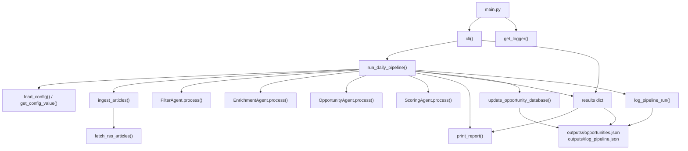

# Tech Radar

An AI-powered system for detecting emerging technology trends and startup opportunities. It ingests data from RSS feeds, APIs, and social media, filters relevant information, enriches it with AI, and identifies potential startup opportunities based on founder profiles.

## Features

- **Multi-source ingestion**: RSS feeds, APIs, social media
- **Intelligent filtering**: Keyword-based relevance scoring
- **AI enrichment**: Summaries, tags, entity extraction
- **Opportunity identification**: Startup idea generation based on founder profiles
- **Modular architecture**: Easy to extend with new agents and sources
- **Configuration-driven**: YAML-based setup
- **Cloud-ready**: Designed for local and cloud deployment

## Installation

### Prerequisites

- Python 3.11+
- [uv](https://github.com/astral-sh/uv) package manager

### Setup

1. **Install uv** (if not already installed):

   **On Linux/macOS:**
   ```bash
   curl -LsSf https://astral.sh/uv/install.sh | sh
   ```

   **On Windows (PowerShell):**
   ```powershell
   powershell -ExecutionPolicy ByPass -c "irm https://astral.sh/uv/install.ps1 | iex"
   ```

   Alternatively, on Windows you can use `winget`:
   ```cmd
   winget install --id=astral-sh.uv -e
   ```

2. **Clone the repository**:
   ```bash
   git clone https://github.com/yourusername/tech-radar.git
   cd tech-radar
   ```

3. **Create virtual environment and install dependencies**:
   ```bash
   uv sync
   ```

   This will create a virtual environment and install all dependencies from `pyproject.toml`.

## Usage

Run the application from the repository root:

```bash
uv run python main.py --founder [username]
```

This executes the CLI defined in `main.py` using the environment managed by `uv`.

### Configuration

Edit profile-specific files under `src/config/profiles/<founder_slug>/`:
- `profile.json` for founder context
- `filter.yaml` for RSS sources, thresholds, and model selection

### Running the Pipeline

The main entrypoint is `main.py`. Use these commands from the project root after running `uv sync`.

#### Default Run

To run the pipeline, pass a founder profile from `src/config/profiles/`:

```bash
uv run python main.py --founder tomas_liendro
```

The CLI loads `src/config/profiles/tomas_liendro/profile.json` in this example.

#### Update the Database

To fetch RSS items and update the database before processing, pass `--update-db` with a max item count:
```bash
uv run python main.py --founder tomas_liendro --update-db 30
```

#### Founder Profile Selection

Pass the founder profile slug from `src/config/profiles/`:

```bash
uv run python main.py --founder tomas_liendro
```

### CLI Options

- `--founder`: Founder profile slug from `src/config/profiles/` (default: `tomas_liendro`)
- `--update-db <int>`: Fetch up to N RSS items and update database before processing
- `--enrich` / `--no-enrich`: Enable or skip enrichment
- `--generate-opp`: Generate opportunities from enriched articles
- `--max-opps <int>`: Max opportunities to generate (default: `3`)
- `--skip-score-opps`: Skip scoring opportunities
- `--update-scores`: Clear and recompute opportunity scores
- `--database-file <path>`: Override the SQLite DB path
- `--recreate-on-schema-change`: Rebuild drifted tables (dev option; can delete table data)
- `--clear-feeds`, `--clear-feedback`, `--clear-opportunities`: Clear table data
- `--clear-founder-opps <name>`: Clear opportunities for one founder name
- `--remove-founder <name>`: Remove founder from DB
- `--feed-from-csv <path>`: Import feeds from CSV

### Database JSON Sync

The project keeps SQLite and JSON exports in sync through two scripts used by `main.py`:

- `src/database/import_db.py`: syncs JSON -> DB using upsert and delete-missing semantics (JSON is source of truth for the synced scope)
- `src/database/export_db.py`: syncs DB -> JSON and deduplicates exported records

Important schema note for `founderfeed`:

- Primary key is composite: `(feed_id, founder_name)`.
- Repeated `feed_id` values across different founders are expected.
- Only repeated `(feed_id, founder_name)` pairs are invalid duplicates.

Run them directly if needed:

```bash
uv run python src/database/import_db.py
uv run python src/database/export_db.py
```

`main.py` already runs import before processing and export after processing.

## Project Structure

```
tech-radar/
├── main.py                  # CLI entry point
├── src/
│   ├── agents/              # AI agents
│   │   ├── base_agent.py    # Abstract agent base
│   │   ├── filter_agent.py  # Relevance filtering
│   │   ├── enrichment_agent.py  # Data enrichment
│   │   └── opportunity_agent.py # Opportunity generation
│   ├── ingestion/           # Data sources
│   │   └── rss_ingestion.py # RSS feed parsing
│   ├── pipeline/            # Orchestration
│   │   └── daily_pipeline.py # Main pipeline logic
│   ├── config/              # Configuration
│   │   └── config.yaml      # YAML config file
│   └── utils/               # Utilities
│       └── logger.py        # Logging setup
├── pyproject.toml           # Project metadata and dependencies
├── uv.lock                  # Dependency lock file
└── README.md               # This file
```

## Main Dependency Diagram

This diagram shows the `main.py` execution path, the pipeline stages invoked by `run_daily_pipeline()`, and the output artifacts created by the run.



## Development

### Adding New Agents

1. Create a new agent class inheriting from `BaseAgent`
2. Implement the `process(items: List[Dict]) -> List[Dict]` method
3. Add it to the pipeline in `daily_pipeline.py`

### Adding New Data Sources

1. Create a new ingestion module in `src/ingestion/`
2. Implement a function returning `List[Dict]` with article data
3. Update `daily_pipeline.py` to use the new source

### Testing

Run tests with:
```bash
uv run pytest
```

## SQLite Explorer UI

If you want a simple local UI to inspect the SQLite database, filter rows, sort columns, and export the current view to CSV, run:

```bash
uv run streamlit run sqlite_explorer.py -- --db outputs/tech_radar.db
```

What it supports:

- table picker
- text, numeric, and boolean filters per column
- quick search across text-like columns
- server-side sort and pagination
- schema preview and CSV export

This is useful for reviewing `feed`, `opportunity`, `founder`, and `feedback` without opening raw SQL manually.

It is also useful for reviewing `founderfeed`, where each row is founder-specific and keyed by `(feed_id, founder_name)`.

`sqlite_explorer.py` now includes optional JSON -> DB sync controls in the sidebar. You can pass a founder list at launch:

```bash
uv run streamlit run sqlite_explorer.py -- --db outputs/tech_radar.db --founders tomas_liendro,sebastian_calvera
```

## Daily Automatic Refresh

Yes, but not with Git alone. The practical way is GitHub Actions: a scheduled workflow can run the pipeline every day, update `outputs/tech_radar.db`, and commit the new database back to the repository.

The workflow is defined in `.github/workflows/daily-db-refresh.yml` and runs daily at `06:00 UTC`. You can also trigger it manually from the Actions tab.

Required setup:

- add the repository secret `OPENAI_API_KEY`
- allow Actions to have write access to repository contents

Default behavior of the scheduled job:

- fetch up to 30 RSS items
- use founder profile `tomas_liendro`
- generate opportunities
- score opportunities
- commit `outputs/tech_radar.db` only if it changed

Manual local equivalent:

```bash
uv run python main.py --founder tomas_liendro --update-db 30 --generate-opp --no-skip-score-opps
```

## SQL Explorer

To open the database explorer, open the following [https://tech-radar-app65imfqyxbjhunwphf2pf.streamlit.app/](https://tech-radar-app65imfqyxbjhunwphf2pf.streamlit.app/)

## Contributing

1. Fork the repository
2. Create a feature branch
3. Make your changes
4. Add tests if applicable
5. Submit a pull request

## License

MIT License - see LICENSE file for details
