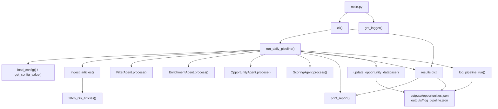

# Tech Radar

An AI-powered system for detecting emerging technology trends and startup opportunities. It ingests data from RSS feeds, APIs, and social media, filters relevant information, enriches it with AI, and identifies potential startup opportunities based on founder profiles.

## Features

- **Multi-source ingestion**: RSS feeds, APIs, social media
- **Intelligent filtering**: Keyword-based relevance scoring
- **AI enrichment**: Summaries, tags, entity extraction
- **Opportunity identification**: Startup idea generation based on founder profiles
- **Modular architecture**: Easy to extend with new agents and sources
- **Configuration-driven**: YAML-based setup
- **Cloud-ready**: Designed for local and cloud deployment

## Installation

### Prerequisites

- Python 3.11+
- [uv](https://github.com/astral-sh/uv) package manager

### Setup

1. **Install uv** (if not already installed):

   **On Linux/macOS:**
   ```bash
   curl -LsSf https://astral.sh/uv/install.sh | sh
   ```

   **On Windows (PowerShell):**
   ```powershell
   powershell -ExecutionPolicy ByPass -c "irm https://astral.sh/uv/install.ps1 | iex"
   ```

   Alternatively, on Windows you can use `winget`:
   ```cmd
   winget install --id=astral-sh.uv -e
   ```

2. **Clone the repository**:
   ```bash
   git clone https://github.com/yourusername/tech-radar.git
   cd tech-radar
   ```

3. **Create virtual environment and install dependencies**:
   ```bash
   uv sync
   ```

   This will create a virtual environment and install all dependencies from `pyproject.toml`.

## Usage

### Configuration

Edit `src/config/config.yaml` to configure:
- RSS feed URLs
- Agent parameters (thresholds, models)
- Database settings

### Running the Pipeline

#### Dry Run (Recommended for Testing)

To run a dry run without persisting data:
```bash
uv run python main.py --dry-run
```

This will execute the full pipeline (ingestion → filtering → enrichment → opportunity generation) and print the results to stdout.

#### Full Run

To run the complete pipeline with data persistence:
```bash
uv run python main.py
```

#### Custom Founder Profile

Pass a JSON string with founder profile:
```bash
uv run python main.py --founder '{"skills": ["AI", "Python"], "vision": "Build AI startups"}'
```

### CLI Options

- `--dry-run`: Run without persistence
- `--founder`: JSON string with founder profile (default: empty dict)

## Project Structure

```
tech-radar/
├── main.py                  # CLI entry point
├── src/
│   ├── agents/              # AI agents
│   │   ├── base_agent.py    # Abstract agent base
│   │   ├── filter_agent.py  # Relevance filtering
│   │   ├── enrichment_agent.py  # Data enrichment
│   │   └── opportunity_agent.py # Opportunity generation
│   ├── ingestion/           # Data sources
│   │   └── rss_ingestion.py # RSS feed parsing
│   ├── pipeline/            # Orchestration
│   │   └── daily_pipeline.py # Main pipeline logic
│   ├── config/              # Configuration
│   │   └── config.yaml      # YAML config file
│   └── utils/               # Utilities
│       └── logger.py        # Logging setup
├── pyproject.toml           # Project metadata and dependencies
├── uv.lock                  # Dependency lock file
└── README.md               # This file
```

## Main Dependency Diagram

This diagram shows the `main.py` execution path, the pipeline stages invoked by `run_daily_pipeline()`, and the output artifacts created by the run.



## Development

### Adding New Agents

1. Create a new agent class inheriting from `BaseAgent`
2. Implement the `process(items: List[Dict]) -> List[Dict]` method
3. Add it to the pipeline in `daily_pipeline.py`

### Adding New Data Sources

1. Create a new ingestion module in `src/ingestion/`
2. Implement a function returning `List[Dict]` with article data
3. Update `daily_pipeline.py` to use the new source

### Testing

Run tests with:
```bash
uv run pytest
```

## Contributing

1. Fork the repository
2. Create a feature branch
3. Make your changes
4. Add tests if applicable
5. Submit a pull request

## License

MIT License - see LICENSE file for details